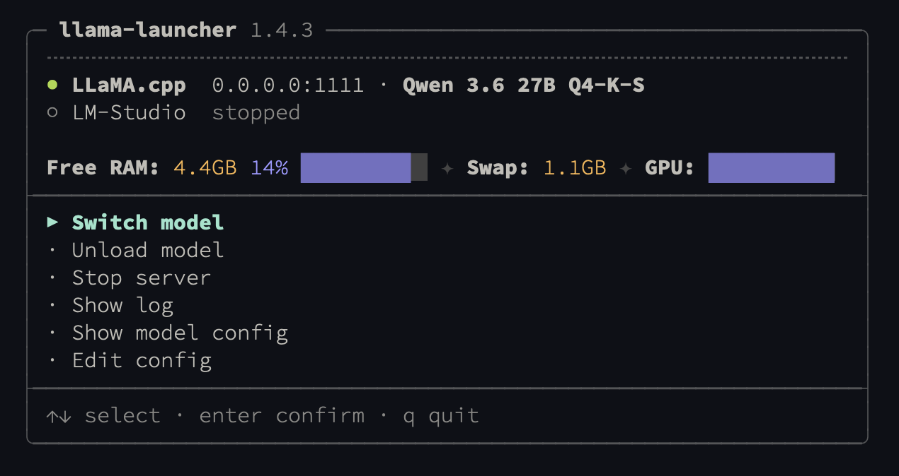
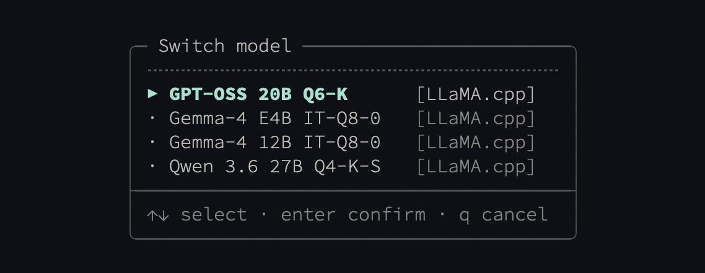

# llama-launcher

A terminal tool for managing local LLM servers through named configuration profiles. Supports [llama.cpp](https://github.com/ggerganov/llama.cpp), [Ollama](https://ollama.com), and [LM Studio](https://lmstudio.ai) as backends. Define your models and parameters once in a YAML file, then load and switch between them with a single command or an interactive TUI.

`llama-launcher` is a process manager, not a request router: it starts and stops LLM servers and tells them which model to load. Clients talk to each server directly via its native address. The launcher exits after dispatching work, consuming zero resident memory while the server runs. Multiple instances of any supported server may run concurrently as long as each binds a distinct `host:port`.

See [CONTEXT.md](CONTEXT.md) for the project's domain language and [docs/adr/](docs/adr/) for the architectural decisions behind the design.

<p align="center">
  
</p>

<p align="center">
  
</p>

## Install

### Homebrew (macOS)

```bash
brew tap airiclenz/tap
brew install llama-launcher
```

### From source

Requires Go 1.26+.

```bash
make install
```

## Quick start

```bash
# First run generates an example config
llama-launcher
# => Created example config at: ~/.config/llama-launcher/config.yaml

# Edit the config with your model paths, then run again
llama-launcher
```

## Configuration

The config lives at `~/.config/llama-launcher/config.yaml` (override with `--config` or `LLAMA_LAUNCHER_CONFIG`).

### Default config generated on first run

The first time you run `llama-launcher` without an existing config, this file is written verbatim from [`internal/launcher/defaults/config.yaml`](internal/launcher/defaults/config.yaml):

```yaml
# llama-launcher configuration
#
# Three server types are supported:
#
#   llamacpp   — llama.cpp's llama-server binary. The launcher forks the
#                process, tracks PID, and restarts to switch models.
#
#   ollama     — Ollama. Connects to running instance or auto-starts
#                "ollama serve". Models loaded/unloaded via HTTP API.
#
#   lmstudio   — LM Studio. Connects to running instance or auto-starts
#                via "lms server start". Models loaded/unloaded via HTTP API.

# ──────────────────────────────────────────────────────────────
# Servers
# ──────────────────────────────────────────────────────────────
#
# Enable the servers available on your system.
# Binaries are auto-detected from PATH; default ports are
# per-backend (llamacpp: 8080, ollama: 11434, lmstudio: 1234).

servers:
  llamacpp: true
  ollama: false
  lmstudio: false

# ──────────────────────────────────────────────────────────────
# Paths
# ──────────────────────────────────────────────────────────────

# Base directory for model files (llamacpp only - LM-Studio supports
# re-loating it's models folder so LLaMA.cpp can share it).
# Profile model paths are resolved relative to this directory
# unless they are absolute. Supports ~ expansion.
models_dir: ~/Models

# Directory for server log files.
log_dir: ~/.config/llama-launcher/logs

# ──────────────────────────────────────────────────────────────
# Loader / Launcher behaviour
# ──────────────────────────────────────────────────────────────

# Automatically stop the old server when switching to a different backend (default: true).
# Set to false to allow multiple servers to run simultaneously.
auto_stop_server: true

# Automatically unload the current model when loading a different one on the same
# server (default: true). Set to false to keep multiple models loaded at once.
auto_unload: true

# Automatically delete log files older than N days on server start.
log_retention: 7

# ──────────────────────────────────────────────────────────────
# UI behaviour
# ──────────────────────────────────────────────────────────────

# Display the llama-launcher UI centered in the terminal (default: false).
display_centered: true

# Close the launcher after selecting a menu action (default: true).
# Set to false to keep the interactive menu open after each action.
auto_close: false

# Sort profiles alphabetically (favourites first, then by server, then by name)
# in menus and `list` output (default: true). Set to false to list profiles in
# the order they appear under `profiles:` below.
sort_alphabetically: true

# How often (seconds) the interactive menu polls the servers. Drives the
# server / loaded-model status lines and how quickly the menu picks up
# background changes — a model loaded or unloaded from another terminal
# rebuilds the menu on the next tick. The memory readout below refreshes
# on its own fixed 1-second tick, independent of this value.
# Minimum 1 second; values below 1 are clamped. Default: 10.
# refresh_duration: 10

# Show a memory + swap readout in the status header (default: true).
# Refreshes every second while the menu is open, independent of
# refresh_duration; the underlying sysctl / vm_stat / ioreg shell-outs
# are cached just below that tick.
# show_memory_status: true

# Template for the memory readout. Placeholders are substituted with
# humanised byte values (e.g. "12.4GB") or rounded integer percentages
# (e.g. "38%"). Unknown placeholders are passed through literally.
# Available placeholders:
#   {free_ram}        — available memory (free + inactive + speculative + purgeable)
#   {used_ram}        — total_ram - free_ram
#   {total_ram}       — physical RAM reported by hw.memsize
#   {compressed_ram}  — bytes held by the kernel's memory compressor
#   {swap_used}       — swap currently in use
#   {swap_total}      — total swap allocated
#   {free_swap}       — swap_total - swap_used
#   {free_ram_pct}    — free_ram / total_ram as rounded integer percentage
#   {used_ram_pct}    — used_ram / total_ram as rounded integer percentage
#   {swap_used_pct}   — swap_used / swap_total as rounded integer percentage
#                       (0% when swap is disabled)
#   {gpu_util_pct}    — GPU "Device Utilization %" from ioreg (Apple Silicon only)
#   {gpu_used_ram}    — unified RAM currently held by the GPU (Apple Silicon only)
#   {gpu_alloc_ram}   — unified RAM allocated to the GPU (Apple Silicon only)
# GPU values read 0 on Intel Macs or when ioreg is unavailable.
# memory_status_format: "RAM: {free_ram} free · Swap: {swap_used} used"

# ──────────────────────────────────────────────────────────────
# Default parameters
# ──────────────────────────────────────────────────────────────
#
# Shared by all profiles. Per-profile values override these.
# Each profile should declare `server:` explicitly (see ADR-0005);
# `defaults.server` is soft-deprecated and only kept as a fallback
# when more than one server is enabled.
#
# Not all parameters apply to all servers:
#
#   Parameter       llamacpp   ollama   lmstudio
#   ─────────────   ────────   ──────   ────────
#   gpu_layers      yes        -        yes (mapped: 99→"max", 0→"off")
#   threads         yes        -        -
#   threads_batch   yes        -        -
#   batch_size      yes        -        yes (mapped to eval_batch_size)
#   context_size    yes        -        yes
#   host / port     yes        yes      yes
#   flash_attn      yes        -        yes
#   cont_batching   yes        -        -
#   parallel        yes        -        -
#   mlock           yes        -        -
#   no_mmap         yes        -        -
#   embedding       yes        -        -
#   jinja           yes        -        -        (enables Jinja chat template)
#   temperature     yes        -        -
#   repeat_penalty  yes        -        -
#   top_k           yes        -        -
#   top_p           yes        -        -
#   min_p           yes        -        -

defaults:
  gpu_layers: 99
  threads: 8
  threads_batch: 8
  batch_size: 512
  context_size: 4096
  host: "127.0.0.1"
  port: 8080
  flash_attn: true
  cont_batching: true
  parallel: 1
  mlock: false
  no_mmap: false
  embedding: false
  jinja: false
  temperature: 0.7
  repeat_penalty: 1.1
  top_k: 40
  top_p: 0.95
  min_p: 0.05

# ──────────────────────────────────────────────────────────────
# Profiles
# ──────────────────────────────────────────────────────────────
#
# Each profile specifies a model to load. The "server" field
# selects which server to use and should be set on every profile.
# Profile parameters override any parameter from the defaults block.
#
# Profile fields:
#   title         Optional human-readable label shown wherever the profile
#                 appears (menus, status header). Falls back to the profile
#                 name when unset.
#   description   Optional longer text shown only in the "Show model config"
#                 pop-up.
#   model         Model reference (file path for llamacpp, name for ollama,
#                 publisher/repo/file for lmstudio)
#   server        Server to use (llamacpp, ollama, lmstudio)
#   is_favourite  Pin this profile to the top of the menu (default: false).
#                 Favourites sort before all other profiles.
#   extra_args    Additional CLI flags appended verbatim (llamacpp only)
#   <param>       Any parameter from the defaults block

profiles:
  # ── llama.cpp example ──────────────────────────────────────
  # Model is a file path, resolved relative to models_dir.
  example:
    title: "Example Model"
    description: "Example profile"
    server: llamacpp
    model: your-model-file.gguf
    context_size: 8192
    # is_favourite: true

  # ── LM Studio examples ────────────────────────────────────
  # Model is an LM Studio model key (publisher/repo or full path
  # with quantization). Run "lms ls" to see available models.
  # Uncomment lmstudio in the servers section above.
  #
  # lmstudio-llama:
  #   description: "Llama 3.1 8B via LM Studio"
  #   server: lmstudio
  #   model: lmstudio-community/meta-llama-3.1-8b-instruct
  #   context_size: 16384
  #   flash_attn: true
  #   gpu_layers: 99
  #   batch_size: 512
  #
  # lmstudio-qwen:
  #   description: "Qwen 2.5 32B via LM Studio"
  #   server: lmstudio
  #   model: lmstudio-community/qwen2.5-32b-instruct
  #   context_size: 8192
  #   gpu_layers: 99

  # ── Ollama examples ────────────────────────────────────────
  # Model is an Ollama model name (e.g. "llama3.1:8b").
  # Must be pulled first: ollama pull <model>
  # Uncomment ollama in the servers section above.
  #
  # ollama-llama3:
  #   description: "Llama 3.1 8B via Ollama"
  #   server: ollama
  #   model: llama3.1:8b
  #
  # ollama-codellama:
  #   description: "Code Llama 13B via Ollama"
  #   server: ollama
  #   model: codellama:13b
```

Parameters merge in three tiers: **profile > defaults > built-in fallbacks**. All numeric and boolean params use pointer types so "not set" is distinct from zero.

Set `is_favourite: true` on a profile to pin it to the top of menus and `list` output. Profiles are sorted by favourite status first, then alphabetically by server, then alphabetically by name. Set the top-level `sort_alphabetically: false` to instead list profiles in the order they appear in your config file.

### Memory readout placeholders

`memory_status_format` accepts these placeholders:

| Placeholder | Value |
|-------------|-------|
| `{free_ram}` | Available RAM (free + inactive + speculative + purgeable pages), humanised |
| `{used_ram}` | `total_ram - free_ram`, humanised |
| `{total_ram}` | Total physical RAM, humanised |
| `{compressed_ram}` | Bytes held by the kernel's memory compressor, humanised |
| `{swap_used}` | Swap currently in use, humanised |
| `{swap_total}` | Swap file size, humanised |
| `{free_swap}` | `swap_total - swap_used`, humanised |
| `{free_ram_pct}` | `free_ram / total_ram` as a rounded integer percentage (e.g. `38%`) |
| `{used_ram_pct}` | `used_ram / total_ram` as a rounded integer percentage (e.g. `63%`) |
| `{swap_used_pct}` | `swap_used / swap_total` as a rounded integer percentage; `0%` when swap is disabled |
| `{gpu_util_pct}` | GPU `Device Utilization %` from `ioreg` (Apple Silicon only; reads `0%` on Intel) |
| `{gpu_used_ram}` | Unified RAM currently held by the GPU, humanised (Apple Silicon only) |
| `{gpu_alloc_ram}` | Unified RAM allocated to the GPU, humanised (Apple Silicon only) |

Byte values are rendered macOS-style: 1024-based units with one decimal (`12.4GB`, `512MB`), whole values drop the decimal (`8GB`). Unknown placeholders are left in place.

See the [technical design doc](llama-launcher.TDD.md) for full schema details and behavior.

### Backends

| Backend | Default address | Model reference |
|---------|-----------------|-----------------|
| `llamacpp` | `127.0.0.1:8080` | File path (relative to `models_dir` or absolute) |
| `ollama` | `localhost:11434` | Ollama model name (e.g. `llama3.1:8b`) |
| `lmstudio` | `localhost:1234` | LM Studio model key (e.g. `lmstudio-community/meta-llama-3.1-8b-instruct`) |

For each backend, the launcher knows how to start the server (fork-and-detach for `llamacpp`; `ollama serve` for Ollama; `lms server start` for LM Studio) and how to stop it. `stop` is unconditional — the launcher does not distinguish servers it started from servers that were already running (see [ADR-0001](docs/adr/0001-stop-is-unconditional.md)).

## Usage

### Interactive mode

Run without arguments to get the TUI menu:

```
llama-launcher
```

The menu adapts to three states:

- **Stopped** -- select a profile to start the server and load a model
- **Running with model** -- switch models (hidden when only one profile is configured), unload model, stop server, show log, show model config, edit config
- **Running (no model)** -- load a profile, stop server, show log, edit config

When more than one instance is running, the relevant actions (stop, unload, show log) present an instance picker disambiguated by `host:port`.

### CLI commands

```bash
llama-launcher load <profile> [--restart]   # Activate a profile (no-op if already active; --restart forces)
llama-launcher unload [profile]             # Unload model from the matching instance
llama-launcher start [--profile p]          # Start server (optionally with a profile)
llama-launcher stop [target]                # Stop a server (target = host:port or backend name)
llama-launcher status [--json]              # Show all running instances (--json for structured output)
llama-launcher list [--json]                # List available profiles (--json for structured output)
llama-launcher logs [target] [-f]           # Tail an instance's log
llama-launcher logs clean [--days N|--all]  # Remove old log files
```

### Options

```
--config <path>    Use a custom config file instead of the default
```

## Building

Requires Go 1.26+.

```bash
make build      # Build the binary
make install    # Build + install to ~/.local/bin
make clean      # Remove the binary
```

The version is read from the `VERSION` file and injected at build time.

## Architecture

All code lives in `internal/launcher/`. Three LLM Servers are implemented behind a common `LLMServer` interface: llama.cpp, Ollama, and LM Studio. The architectural decisions are written down as [ADRs](docs/adr/); the domain language is in [CONTEXT.md](CONTEXT.md); the technical design doc is [llama-launcher.TDD.md](llama-launcher.TDD.md).

Key paths:

| Path | Purpose |
|------|---------|
| `~/.config/llama-launcher/config.yaml` | Configuration |
| `~/.config/llama-launcher/logs/` | Server log files for instances the launcher started |

The launcher does not persist runtime state. Each command rediscovers running servers by probing the addresses in your config and asking each LLM Server's own API which model is loaded. `llama-launcher logs` covers launcher-managed servers only; servers started outside the launcher log wherever you started them.

## License

See [LICENSE](LICENSE.md) for details.
