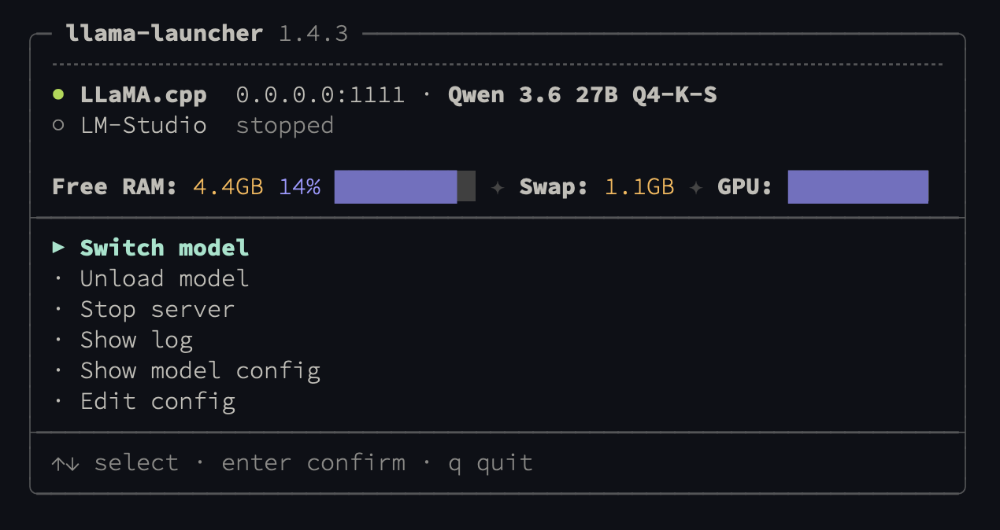
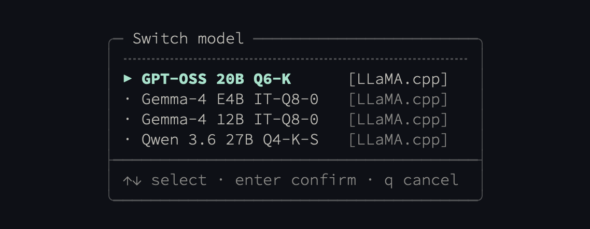

# llama-launcher

[](https://github.com/airiclenz/llama-launcher/releases)
[](LICENSE.md)
[](https://pkg.go.dev/github.com/airiclenz/llama-launcher/launcher)

A terminal tool for managing local LLM servers through named configuration profiles. Supports [llama.cpp](https://github.com/ggerganov/llama.cpp), [Ollama](https://ollama.com), [LM Studio](https://lmstudio.ai), and [Splash](https://github.com/incoai/splash) (an MLX-based server for Apple Silicon) as backends. Define your models and parameters once in a YAML file, then load and switch between them with a single command or an interactive TUI.

`llama-launcher` is a process manager, not a request router: it starts and stops LLM servers and tells them which model to load. Clients talk to each server directly via its native address. The launcher exits after dispatching work, consuming zero resident memory while the server runs.

<p align="center">
  
</p>

<p align="center">
  
</p>

## Install

### Homebrew (macOS)

```bash
brew tap airiclenz/tap
brew install llama-launcher
```

This installs the `llama-launcher` CLI and the optional `llama-launcher-mcp` control-plane adapter (see [Remote control from a container](#remote-control-from-a-container-mcp)). The adapter is inert until you start it.

### From source

Requires Go 1.26+.

```bash
make build      # => ./llama-launcher, for local testing
```

Installation is deliberately Homebrew-only; `make install` just points you there.

## Quick start

```bash
# First run generates an example config, reloads it and opens the profile menu
llama-launcher
# => Created example config at: ~/.config/llama-launcher/config.yaml

# Edit the config with your model paths; the menu picks changes up on its own
llama-launcher
```

## Configuration

The config lives at `~/.config/llama-launcher/config.yaml` (override with `--config` or `LLAMA_LAUNCHER_CONFIG`). The generated example is fully commented and documents every option — [`internal/launcher/defaults/config.yaml`](internal/launcher/defaults/config.yaml) is the complete reference. A minimal config looks like this:

```yaml
servers:
  llamacpp: true

models_dir: ~/Models     # base directory for model files (llamacpp)

defaults:                # shared by all profiles
  gpu_layers: 99
  threads: 8
  context_size: 8192

profiles:
  qwen-coder:
    title: "Qwen 2.5 Coder 32B"
    server: llamacpp
    model: qwen2.5-coder-32b-q4_k_m.gguf   # relative to models_dir
    context_size: 32768
    is_favourite: true                     # pinned to the top of menus

  llama-8b:
    server: llamacpp
    model: llama-3.1-8b-instruct-q5_k_m.gguf
```

Parameters merge in three tiers: **profile > defaults > built-in fallbacks**. "Not set" is always distinct from zero. Not every parameter applies to every backend — the commented example config has the full parameter/backend matrix.

Other top-level options control launcher behaviour (`auto_stop_server`, `auto_unload`, `log_retention`) and the TUI (`display_centered`, `auto_close`, `sort_alphabetically`, `refresh_duration`, and the memory readout below).

### Backends

| Backend | Default address | Model reference |
|---------|-----------------|-----------------|
| `llamacpp` | `127.0.0.1:8080` | File path (relative to `models_dir` or absolute) |
| `ollama` | `localhost:11434` | Ollama model name (e.g. `llama3.1:8b`, pulled first) |
| `lmstudio` | `localhost:1234` | LM Studio model key (e.g. `lmstudio-community/meta-llama-3.1-8b-instruct`) |
| `splash` | `127.0.0.1:8000` | Hugging Face `owner/repo` id (e.g. `incoai/Qwen3.8-27B-Splash`), installed once via `splash serve --model …` |

For each backend, the launcher knows how to start the server (fork-and-detach for `llamacpp` and `splash`; `ollama serve` for Ollama; `lms server start` for LM Studio) and how to stop it. `stop` is unconditional — the launcher does not distinguish servers it started from servers that were already running (see [ADR-0001](docs/adr/0001-stop-is-unconditional.md)). Multiple instances may run concurrently as long as each binds a distinct `host:port`.

#### Splash

Splash, like `llamacpp`, is restarted to switch models: each profile starts `splash serve --model <owner/repo>` with its own settings.

- **Put `splash` on `PATH`.** The launcher runs whatever `splash` command it finds there. For a source checkout, use a small wrapper script rather than a symlink — the checkout's script finds its own directory from the path it was called by, which a symlink breaks:

  ```bash
  printf '#!/bin/sh\nexec "$HOME/Repos/splash/splash" "$@"\n' > ~/.local/bin/splash && chmod +x ~/.local/bin/splash
  ```

  A launcher or MCP adapter started by launchd does not see your shell's `PATH`, so its `PATH` must include the wrapper's directory (e.g. `~/.local/bin`) too.
- **Install each model once, by hand.** Run `splash serve --model <owner/repo>` in a terminal; the first run downloads the model, which can take around twenty minutes. The launcher checks the Hugging Face cache (`$HF_HUB_CACHE`, else `$HF_HOME/hub`, else `$XDG_CACHE_HOME/huggingface/hub`, else `~/.cache/huggingface/hub`) for the installed model and refuses a profile whose model is not there, naming that command. It never starts the download itself ([ADR-0014](docs/adr/0014-splash-models-must-be-installed.md)).
- **Parameters.** `context_size` becomes `--max-context`, and `host` / `port` become `--host` / `--port`. Sampling parameters are ignored. Pass any other Splash flag — reasoning effort, KV format, max memory — through the profile's `extra_args`.
- **Network access.** Splash refuses requests whose `Host` names a host it does not know. When a profile's `host` is not loopback (for example `0.0.0.0` or a LAN address), the launcher adds `--allowed-host` for the machine's hostname and its short form (`Apollo-II.local` and `Apollo-II`), so LAN clients can reach it by IP or by hostname. Add `--allowed-host` to `extra_args` only for other names, such as a reverse proxy or a DNS alias. A Splash bound to `0.0.0.0` is still probed, listed and stopped by its configured address; the launcher's own checks reach it over loopback.

### API keys

Each entry in the `servers` section can carry an optional API key by switching from the bool form to the mapping form (`enabled` defaults to `true` when omitted):

```yaml
servers:
  llamacpp:
    api_key: "secret"
  lmstudio:
    enabled: true
    api_key: "lm-studio-abc123..."
  ollama: false
```

The key doesn't have to live in the file. `api_key_cmd` names a command whose standard output *is* the key — typically a lookup in your secret store:

```yaml
servers:
  llamacpp:
    api_key_cmd: "security find-generic-password -s llama-launcher -a llamacpp -w"
```

The command is handed whole to a shell (pipelines work) and runs once at startup for every enabled server. Because any line there runs as you, on macOS and Linux the launcher runs it only from a config file you own that nobody else can write: a file owned by another account, or group- or world-writable, stops the launcher with an error naming the file and the fix (`chmod 600 <path>`), and nothing runs. `config validate` does not check this — the next load does. Set `api_key` or `api_key_cmd`, never both. If you *do* want a literal key to stay in the file, set `plaintext_key_ok: true` on the entry so nothing offers to move it into a secret store.

While a literal key sits in the file without `plaintext_key_ok: true`, running `llama-launcher` with no arguments raises one offer before the menu — move the key(s) into your machine's secret store (the entry's `api_key` line becomes an `api_key_cmd` line, and only after the stored key has been read back through it), not now (asked again next launch), or never for these entries (records `plaintext_key_ok: true`). Subcommands never prompt, so they print a one-line warning naming the entries, the config file this run read, and the ways out by hand instead.

The launcher is not a proxy, so what the key does depends on the backend:

| Backend | Effect of `api_key` |
|---------|---------------------|
| `llamacpp` | Exported as `LLAMA_API_KEY` into the launched server's environment — llama-server then rejects client requests without `Authorization: Bearer <key>` (its `/health` endpoint stays open). Deliberately never put on the command line, so the key does not show up in `ps`. |
| `lmstudio` | LM Studio manages its own token: enable *Require API token* in its Server Settings, generate a token there, and paste it here so the launcher's health checks and model loads keep working. |
| `ollama` | Ollama has no native authentication. Set a key only when the instance sits behind an authenticating reverse proxy; the launcher then sends it with its own requests. |
| `splash` | Exported as `SPLASH_API_KEY` into the launched server's environment — Splash then rejects client requests without `Authorization: Bearer <key>`. Never put on the command line. |

In all cases the launcher attaches the key as a `Bearer` header to the HTTP calls it makes itself (health checks, model load/unload, model listing). The config file is created with mode 0600. For `llamacpp`, an `extra_args` `--api-key` does not replace the configured key: llama-server appends it, so *both* keys are accepted (observed on llama.cpp b10851) — and that literal extra key *is* visible in `ps`. To change the key, change `api_key` rather than adding an override.

Log text the launcher shows you — `llama-launcher logs`, the menu's *Show log*, the log tail printed when a server dies at start, and the MCP `tail_log` tool — has the configured key and any `--api-key` value replaced with `[redacted]`. The log files on disk are left as the server wrote them.

### Memory readout

The TUI's status header shows a live memory + swap readout (macOS), fully customizable via `memory_status_format` — colored spans, 24-bit colors, and bar-graph gauges:

```yaml
memory_status_format: "{bold}Free RAM:{reset} {yellow}{free_ram} {bright-blue}{free_ram_pct}{reset} {used_ram_pct:bar} ✦ {bold}Swap:{reset} {yellow}{swap_used}{reset} ✦ {bold}GPU:{reset} {gpu_util_pct:bar}"
```

<details>
<summary>Placeholders, style tags, and bar syntax</summary>

#### Placeholders

| Placeholder | Value |
|-------------|-------|
| `{free_ram}` | Available RAM (free + inactive + speculative + purgeable pages), humanised |
| `{used_ram}` | `total_ram - free_ram`, humanised |
| `{total_ram}` | Total physical RAM, humanised |
| `{compressed_ram}` | Bytes held by the kernel's memory compressor, humanised |
| `{swap_used}` / `{swap_total}` / `{free_swap}` | Swap in use / allocated / remaining, humanised |
| `{free_ram_pct}` / `{used_ram_pct}` | Rounded integer percentages of total RAM (e.g. `38%`) |
| `{swap_used_pct}` | Percentage of allocated swap; `0%` when swap is disabled |
| `{gpu_util_pct}` | GPU `Device Utilization %` from `ioreg` (Apple Silicon only) |
| `{gpu_used_ram}` / `{gpu_alloc_ram}` | Unified RAM held by / allocated to the GPU (Apple Silicon only) |

Byte values are rendered macOS-style: 1024-based units with one decimal (`12.4GB`), whole values drop the decimal (`8GB`). Unknown placeholders are left in place.

#### Style tags

| Tags | Effect |
|------|--------|
| `{black}` `{red}` `{green}` `{yellow}` `{blue}` `{magenta}` `{cyan}` `{white}` `{gray}` | Standard ANSI colors |
| `{bright-red}` … `{bright-white}` | Bright ANSI variants |
| `{0}` … `{255}` | 256-color palette index, e.g. `{208}` |
| `{#rrggbb}` | Exact 24-bit color, e.g. `{#7aa2f7}` (short `{#rgb}` works too) |
| `{bold}` `{dim}` `{reset}` | Text styles / back to terminal default |

Named colors are resolved by your terminal theme; palette-index and hex colors render the same everywhere. A template without style tags or bars keeps the classic all-dim rendering; as soon as it contains one, you control all styling yourself.

#### Bar graphs

Any percentage placeholder can render as a value-less bar gauge: `{pct_name:bar[:width[:color[:bgcolor]]]}`. Trailing parts are optional and fall back to the `memory_status_bar` block:

```yaml
memory_status_bar:    # defaults for every {..._pct:bar} token
  width: 10           # cells, clamped to 1–40
  color: green        # filled portion
  background: gray    # empty portion
```

Bars fill with block glyphs (eighth-block partials give 8 fill levels per cell) against a solid background — one continuous strip. Colors accept the same three forms as style tags. Malformed tokens are passed through literally, so typos are visible rather than silently dropped.

</details>

See the [technical design doc](llama-launcher.TDD.md) for full schema details and behavior.

## Usage

### Interactive mode

Run without arguments to get the TUI menu. It adapts to three states:

- **Stopped** — select a profile to start the server and load a model
- **Running with model** — switch models, unload model, stop server, show log, show model config, edit config
- **Running (no model)** — load a profile, stop server, show log, edit config

**Edit config** opens the config file with `open` on macOS (the default app for `.yaml` files). On other platforms it runs `$VISUAL`, or `$EDITOR` if `$VISUAL` is unset, in the terminal (a value with flags such as `code -w` works) and waits for the editor to exit. If neither is set, the menu leaves the item out.

When more than one instance is running, the relevant actions (stop, unload, show log) present an instance picker disambiguated by `host:port`.

Each profile row shows its title, the effective context size the backend will actually receive (compacted to `4K` / `65K` / `131K` / `1M`), a `[server]` tag when more than one backend is enabled, and the `★` favourite marker:

```
▸ DeepSeek Coder V2 Lite    65K  [LLaMA.cpp]
  Qwen 2.5 32B             131K  [LLaMA.cpp]
  reasoning-phi                  [Ollama   ]
```

The Ollama row is blank because Ollama's load request carries no context length — the column only shows what the backend is actually sent.

### CLI commands

```bash
llama-launcher load <profile> [--restart]   # Activate a profile (no-op if already active; --restart forces)
llama-launcher unload [profile]             # Unload model from the matching instance
llama-launcher start [--profile p]          # Start server without a model (llamacpp and splash require --profile)
llama-launcher stop [target]                # Stop a server (target = host:port or backend name)
llama-launcher status [--json]              # Show all running instances (--json for structured output)
llama-launcher list [--json]                # List available profiles (--json for structured output)
llama-launcher logs [target] [-f]           # Tail an instance's log
llama-launcher logs clean [--days N|--all]  # Remove old log files
llama-launcher config validate              # Check config file for errors
llama-launcher config init [--force]        # Generate example config (--force overwrites)
llama-launcher config reset                 # Reset config to the example (overwrites)
llama-launcher version                      # Print version
```

A server that is still loading its model (llama.cpp answers its health endpoint with 503 for the whole load) is a first-class instance: `status` and the interactive menu show it as `starting…`, and `stop` / `unload` can target it. A plain `load` refuses to displace a still-loading server so a mistyped command cannot throw away a long model load; pass `--restart` to stop and replace it ([ADR-0010](docs/adr/0010-starting-instances-are-visible-and-stoppable.md)). Splash binds its port only once the model has loaded, so the launcher finds a loading Splash server by its process instead (a Splash launch for that host and port with nothing listening yet) and treats it the same way ([ADR-0015](docs/adr/0015-a-loading-splash-is-found-by-its-process.md)). Windows is the exception: the launcher cannot read the process table there, so a loading Splash stays hidden until it is ready.

A server that rejects the configured `api_key` (it answers every backend probing its address with 401 or 403) does not vanish either: `stop` still stops it by signalling whatever listens there, and reports `Stopped server at <host:port>` because no backend could identify it. `load` and `unload` against it fail with the "check api_key" error, and `auto_stop_server` leaves it alone. Only an explicit `stop` touches it. `status`, the menu and every server listing show it as `auth failed at <host:port> — check api_key in the servers section`, and `status --json` reports it as an entry with `"backend": ""`, `"running": false` and `"auth_failed": true` (every other entry carries `"auth_failed": false`).

### When the port is already taken

Starting a llama.cpp server checks the target port first, and refuses before forking if another process is listening there:

```
Error: port 1111 is already in use — LLaMA.cpp cannot bind 0.0.0.0:1111
Listening now:
  PID 15481 (llama-server)
  PID 62070 (Code Helper (Plugin))
Stop the occupying process, or give this profile a different `port` — in its own section or under `defaults`
```

Any interface counts: a process holding `127.0.0.1:<port>` blocks a `0.0.0.0` bind just as a wildcard listener does. That case is worth knowing about, because a foreign listener on loopback also *shadows* your server — the launcher's health probes reach the squatter instead, so `status` reports nothing running and every command waits out a timeout before answering. Editors and IDEs are a common source: VS Code's Remote-SSH and Dev Containers automatically forward ports from the remote machine onto the same local port number, which will quietly take over a port your local server already owns. `lsof -nP -iTCP:<port> -sTCP:LISTEN` shows every holder.

## Remote control from a container (MCP)

`llama-launcher` itself has no network surface — it is a one-shot CLI ([ADR-0002](docs/adr/0002-not-a-router.md)). When a client on another machine needs to control which model is running — typically a coding agent in a container reaching back to the host — an **optional, separate** binary, `llama-launcher-mcp`, exposes the lifecycle commands as [MCP](https://modelcontextprotocol.io) tools over HTTP. It runs on the host, implements every tool by shelling out to the CLI, and never proxies inference traffic ([ADR-0008](docs/adr/0008-mcp-control-plane-adapter.md)).

Tools: `list_profiles`, `server_status`, `tail_log` (read) and `load_profile`, `unload_model`, `start_server`, `stop_server` (mutating, omitted under `--read-only`).

**Trust model:** access is gated by a **source-IP allowlist**, not a token. Bind the listener to the host's container-facing bridge interface (not `0.0.0.0`) and allow the container — by IP, CIDR, hostname, or simply by naming the bridge interface so any IP the bridge hands the container is covered. The client receives no secret it could leak — appropriate when the remote is a cloud LLM agent you don't want to hand credentials to.

```bash
llama-launcher-mcp --listen 192.168.64.1:7331 --allow-interface bridge100
#   --listen           container-facing bridge IP:port (not 0.0.0.0)
#   --allow-interface  local interface whose subnet(s) to allow; repeatable
#   --allow            client IP, CIDR, or hostname; repeatable; loopback by
#                      default. Hostnames resolve once at startup — prefer
#                      --allow-interface or a private CIDR (192.168.64.0/24).
#   --llama-launcher-bin  path to the CLI (default: PATH lookup)
#   --config           llama-launcher config path, forwarded to each call
#   --read-only        expose only the read tools
```

Then point the container's MCP client at `http://192.168.64.1:7331/mcp` — no token, just the URL.

## Using llama-launcher as a Go library

The launcher is importable as well as runnable: the `launcher/` package is a curated Go API over the same core, so your program can load a profile, see what is running, and stop or unload it in-process instead of shelling out to the CLI ([ADR-0011](docs/adr/0011-public-library-facade.md), [TDD §16](llama-launcher.TDD.md#16-public-library-facade)).

```bash
go get github.com/airiclenz/llama-launcher/launcher@v1.7.0
```

```go
cfg, err := launcher.LoadConfig(launcher.DefaultConfigPath(), func(warning string) {
	log.Printf("config warning: %s", warning)
})
if err != nil {
	return err
}
profile, err := cfg.ResolveProfile("qwen-coder") // merged with defaults, model path resolved
if err != nil {
	return err
}
go func() { // the lifecycle verbs block — run them off your UI goroutine
	inst, started, err := launcher.LoadProfile(cfg, profile, false,
		func(step string) { log.Printf("step: %s", step) },       // progress
		func(notice string) { log.Printf("notice: %s", notice) }, // e.g. the drift notice
	)
	if err != nil {
		log.Printf("load failed: %v", err)
		return
	}
	log.Printf("%s serving at %s (server started: %v)", profile.Name, inst.Addr(), started)

	// Stop is also how you cancel a load that is still in flight.
	if _, err := launcher.Stop(inst.Addr()); err != nil {
		log.Printf("stop failed: %v", err)
	}
}()
```

The rest of the surface is `DiscoverRunningInstances(cfg)`, `Unload(backend, addr)`, and five sentinels for `errors.Is`: `ErrConfigNotFound`, `ErrNotRunning`, `ErrStartupTimeout`, `ErrLoadCanceled` and `ErrUnsupported`. The library never writes to your stderr — warnings arrive through the callbacks, and a `nil` callback discards them. `Unload` acts only on the backend you name: when another backend's server holds the address it returns an error matching `ErrNotRunning` and touches nothing.

`ErrStartupTimeout` is the one worth handling explicitly: it means the activation wait expired, not that the load failed. The launcher deliberately leaves the server running, so treat it as "not yet" and keep watching the address with `DiscoverRunningInstances`. `ErrLoadCanceled` is its counterpart: the server the load started was stopped before it became healthy — the result of calling `Stop` on that address from another goroutine — and the load returns promptly instead of waiting out the window. A server that crashes mid-load instead comes back as a plain error with its log tail.

Two caveats before you wire it in: there is **one config per process** (per-server API keys land on a process-global backend registry, so the last `LoadConfig` wins), and the **lifecycle verbs block** — activation waits up to ~30 seconds, plus up to ~20 more when a restart has to stop the current occupant — so call them from a goroutine and serialize your own calls against the same address. The one exception is cancellation: a `Stop` while a `LoadProfile` on that address is still waiting is how you cancel it.

### Supported platforms

The package **compiles on macOS, Linux and Windows**, and each verb works wherever its mechanism exists ([ADR-0012](docs/adr/0012-the-library-compiles-everywhere-and-actuates-where-it-can.md)). No build tags, no stubs on your side.

| Platform | What you get |
|---|---|
| macOS | Everything. |
| Linux | Everything. (Only the TUI's macOS-specific memory readout is dropped.) |
| Windows | Everything the launcher drives over HTTP: discovery, model load/unload against Ollama or LM Studio, and `LoadProfile` against a server that is **already running**. LM Studio start/stop works via the `lms` CLI. Starting `llama-server`, `splash` or `ollama serve` is refused (wrapping `ErrUnsupported`) because Windows lacks the unix process control the launcher would need to stop it again. |

## Building

Requires Go 1.26+.

```bash
make build             # Build the binary (for local testing)
make build-mcp         # Build the optional MCP control-plane adapter
make test              # Unit tests (go test ./...)
make cross             # Cross-compile gate: build + vet for darwin/linux/windows
make check             # test + cross — run this before committing; starts no process
make test-integration  # Real-backend integration suite (host only; see below)
make test-all          # Both test layers (host only)
make clean             # Remove the binaries
```

`make cross` is the platform contract as a check ([ADR-0012](docs/adr/0012-the-library-compiles-everywhere-and-actuates-where-it-can.md)): it builds and vets the whole tree — test files included — for macOS, Linux and Windows, so a portability regression fails here instead of in an importing client's CI.

GitHub Actions runs `make check` on macOS and Linux for every push to `main` and every pull request (`.github/workflows/ci.yml`).

`make test-integration` starts and stops **real** servers (llama-server, Ollama, LM Studio, Splash) on the machine running it — run it manually on the host, never in CI or a container. Each test skips when its backend binary is not on `PATH`. Set `INTEGRATION_MODEL_LLAMACPP` (absolute `.gguf` path), `INTEGRATION_MODEL_OLLAMA`, and/or `INTEGRATION_MODEL_LMSTUDIO` to exercise the model load/unload steps. The Splash tests (`TestSplashLifecycle`, `TestSplashStopWhileLoading`, and `TestSplashWildcardHost`, which binds Splash to `0.0.0.0`) run only with `INTEGRATION_MODEL_SPLASH` set to an already-installed `owner/repo`.

The version is read from the `VERSION` file and injected at build time.

## Architecture

All code lives in `internal/launcher/`, with the public `launcher/` package a thin facade over it. Four LLM servers are implemented behind a common `LLMServer` interface: llama.cpp, Ollama, LM Studio, and Splash. The optional MCP adapter is a separate binary under `cmd/llama-launcher-mcp/` and is the only component with a network listener.

The launcher does not persist runtime state. Each command rediscovers running servers by probing the addresses in your config and asking each server's own API which model is loaded. `llama-launcher logs` covers launcher-managed servers only.

The architectural decisions are written down as [ADRs](docs/adr/); the domain language is in [CONTEXT.md](CONTEXT.md); the technical design doc is [llama-launcher.TDD.md](llama-launcher.TDD.md).

| Path | Purpose |
|------|---------|
| `~/.config/llama-launcher/config.yaml` | Configuration |
| `~/.config/llama-launcher/logs/` | Server log files for instances the launcher started |

## License

[MIT](LICENSE.md)
